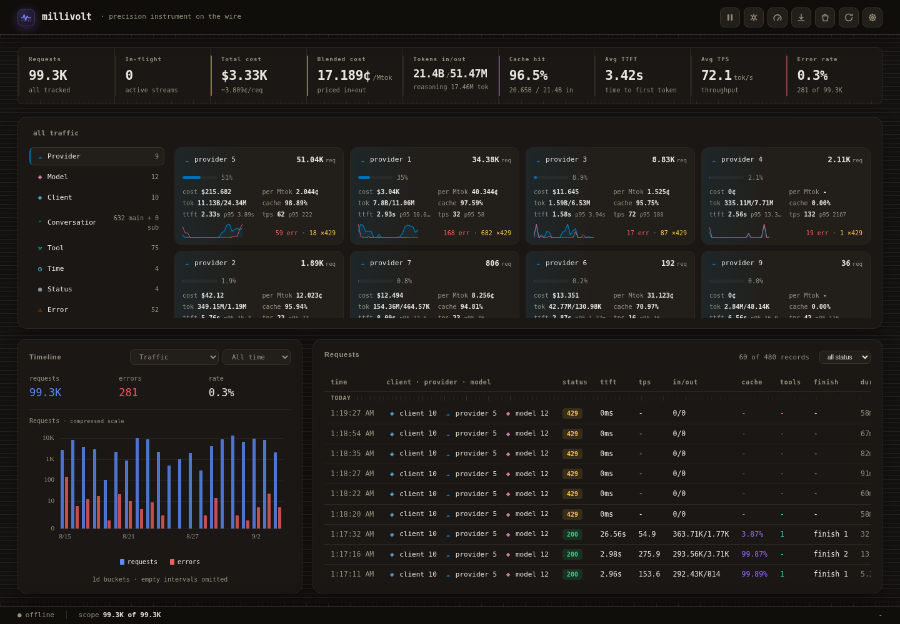

# millivolt

AI requests should not be a black box. When an agent feels slow, retries pile up,
or token usage climbs, millivolt helps you see what is happening and where to
look next. It is a self-hosted inference proxy that brings
live requests and retained history from your apps and agents into one dashboard.
Compare response speed, latency, token usage and provider-reported costs, then
drill down by client, provider, model or conversation.

One client interface, multiple upstream protocols. Your apps and agents talk
to millivolt through an OpenAI-compatible API. On the provider side, millivolt
connects to OpenAI, xAI/Grok and other hosted or local OpenAI-compatible APIs,
with optional adapters translating supported chat and tool workflows to
Anthropic Messages and Cursor's native Connect protocol. See
[upstream compatibility and adapter limits](docs/adapters.md#client-and-upstream-compatibility).

Keep your choice of upstreams and credentials. Clients that support custom
routing headers choose the upstream URL and credentials on each request, so
there is no separate endpoint or API-key registry to maintain in the proxy.

Go from observation to action in the same place: inspect retries and rate
limits, hold new work from a busy client, adjust provider rate and concurrency
limits, or turn on scoped debugging when you need a closer look. You get
visibility and traffic controls together.

Run it on your own infrastructure as one Go service with an embedded dashboard
and SQLite history. The lightweight, non-root Docker image needs no separate
database server or frontend runtime, and the project is MIT licensed. It is
built for people who want to understand and manage their AI traffic without
operating a separate monitoring stack.

[Quickstart](#quickstart) · [What you get](#what-you-get) ·
[Visual guide](docs/dashboard.md) · [Documentation](docs/README.md)

## Dashboard overview

Global totals, scoped exploration, timelines and the request log share one view.
See the [visual dashboard guide](docs/dashboard.md) for focused screenshots of
tokens, speed/latency, cost, providers, models and Settings.



This static capture retains recorded metrics from an authorized history snapshot
with replaced identifiers. The guide explains its capture limitations.

## Before you run

millivolt has **no user isolation**: one shared operator credential protects
the whole dashboard, and inference shares the same listener. Set
`MILLIVOLT_OPERATOR_TOKEN` before exposing the listener beyond loopback:
with it unset the dashboard denies every request. There are no per-user
accounts. An upstream API key does not secure the dashboard. Read
[Security](SECURITY.md) before network exposure.

Durable metrics are **best-effort**: sustained overload can drop records even
when inference succeeds. The dashboard warns about process-local storage drops.
See [storage and accounting](docs/operations.md#storage-and-accounting) for
capacity, memory and backup limitations.

## Quickstart

Linux is supported. Normal Docker deployment needs only the Compose file,
not Go, Node, a source checkout or an image build. Use an unused host port;
for development alongside an existing instance, use
[isolated development](CONTRIBUTING.md#isolated-development).

### Docker Compose

With Docker Engine and the Compose plugin installed, run these commands from
a new, empty deployment directory:

```sh
curl -fsSL https://raw.githubusercontent.com/LLM-4-People/millivolt/main/compose.yaml -o compose.yaml
export MILLIVOLT_OPERATOR_TOKEN='choose-a-long-random-credential'
docker compose pull
docker compose up -d
docker compose logs --tail 50
```

[compose.yaml](compose.yaml) publishes only on host loopback and forwards
`MILLIVOLT_OPERATOR_TOKEN` into the container. Set
`MILLIVOLT_PORT` to an unused host port if needed. Its named volumes retain
history and private Settings configuration when the container is replaced.
Fresh config volumes receive the bundled [configuration example](proxy.example.yaml),
including enabled [Grok/Cursor compatibility profiles](docs/adapters.md#bundled-compatibility-profiles).
No separate config download is needed; existing saved settings are not overwritten.
The runtime is non-root with a read-only root filesystem. Dashboard rebuild is
unavailable in an image. If you replace the named volumes with host bind
mounts, pre-create those directories writable by UID/GID `65532:65532`; see
[persistent state](docs/operations.md#persistent-state-and-configuration).

See [container operation](docs/operations.md#containers) for image selection,
configuration, updates, backups and shutdown, or the
[reverse-proxy guide](docs/reverse-proxy.md) for NGINX and protected ingress.
Stop with `docker compose stop`. Local image builds use a separate
[development Compose](CONTRIBUTING.md#container-development).

### From source

Install the Go toolchain required by [go.mod](go.mod):

```sh
git clone https://github.com/LLM-4-People/millivolt.git
cd millivolt
# Create a local config only if one does not already exist.
test -e proxy.yaml || cp proxy.example.yaml proxy.yaml
export MILLIVOLT_OPERATOR_TOKEN='choose-a-long-random-credential'
go run ./cmd/proxy -config proxy.yaml -listen 127.0.0.1:8080
```

### Connect a client

Open [http://127.0.0.1:8080/](http://127.0.0.1:8080/) for the dashboard. With
`MILLIVOLT_OPERATOR_TOKEN` set, the sign-in page (or the dashboard's one-time
prompt) asks for that value; with it unset, the dashboard stays denied and
only `/healthz`, brand/PWA files and inference respond. Then set
your OpenAI-compatible client's connection options. The host URLs below assume
port 8080; replace it with your chosen `MILLIVOLT_PORT` or source listen port:

| Client setting | Value |
| --- | --- |
| API base URL | `http://127.0.0.1:8080/v1` |
| API key | Your actual upstream key, forwarded through `Authorization`; it does not authenticate dashboard access. |
| Custom header `X-Proxy-Base-URL` | Your upstream API base URL, including its path, such as `/v1`. |
| Optional header `X-Proxy-Client` | A label for this client in the dashboard. |

The client must support custom headers, or middleware that adds them. Select a
model supported by your upstream; millivolt does not register providers or keys.
The settings above use the default OpenAI-compatible upstream relay, including
for xAI/Grok. For native Anthropic Messages or Cursor Connect, keep the client's
OpenAI-compatible interface and select the appropriate `X-Proxy-Format` adapter
plus its required upstream headers; see the
[compatibility guide](docs/adapters.md#client-and-upstream-compatibility).
If the client is another container, its `localhost` is not the proxy: on a shared
Compose network, use the proxy service URL `http://millivolt:8080/v1` instead.
For protected remote access, follow the
[reverse-proxy authentication guidance](docs/reverse-proxy.md#credentials-and-access-control).
For the optional Grok or Cursor account-login helpers, follow
[first-login setup](docs/adapters.md#first-login-helpers) before configuring tokens.

For example, with your own upstream URL, key, and supported model:

```sh
curl http://127.0.0.1:8080/v1/chat/completions \
  -H "X-Proxy-Base-URL: $UPSTREAM_BASE_URL" \
  -H "Authorization: Bearer $UPSTREAM_API_KEY" \
  -H 'Content-Type: application/json' \
  -d "{\"model\":\"$UPSTREAM_MODEL\",\"messages\":[{\"role\":\"user\",\"content\":\"hello\"}]}"
```

The URL variables above are supplied by you, not millivolt settings. For a model
name containing JSON-special characters, use your client's JSON encoder.
The [protocol guide](docs/protocol.md) covers path joining, all routing headers,
native-format adapters, and model listing.

Normal relay paths preserve request content and upstream response content, with
documented exceptions: bounded request/quality buffering, retries, SSE keepalive
comments and failure signaling, optional format translation, and constructed
model lists. This is not an unconditional byte-for-byte or exactly-once contract.

## What you get

### Route requests without a provider registry

- Choose the upstream base URL, credentials, authentication header/prefix,
  path and query on each request. Optional header overrides support custom
  integrations without adding a provider-specific relay branch.
- Constrain accepted upstream URL prefixes through configuration. This helps
  control destinations but does not replace network access or egress controls.
- Forward ordinary HTTP bodies, including streaming responses, with bounded
  request inspection, connection pooling and configurable SSE keepalives.
- Coordinate provider-plus-key concurrency and queues; retry eligible transport,
  transient 429 and server failures with provider hints and configurable backoff.
  Provider-wide concurrency, request-rate and token-rate limits are separate.
- Opt into error storm protection: queue affected provider/model traffic with
  exponential recovery probes and a dashboard incident banner. Provider-wide
  protection requires elevated errors on every model active in the detection
  window; all thresholds and retry/queue bounds are editable in Settings.
- Discover models through the standard model-list routes, with recognized-list
  normalization, supported pagination and optional metadata enrichment.
- Opt into Anthropic Messages translation or the Cursor Connect text/tool
  bridge. Supported inference-token refresh returns credentials through a shared
  handback response; clients adopt them and retry. Model discovery refreshes
  transparently. Clients remain responsible for their own authorization.

See [routing, timing and discovery](docs/protocol.md) and
[adapter support and limitations](docs/adapters.md). Compatibility profiles are
editable configuration, not a guarantee of provider access or protocol coverage.

### Explore live traffic and retained history

- View global request/token/cost totals and timing averages alongside event-driven
  in-flight rows. Initial HTML embeds server-computed state; live SSE and polling
  maintain the same observation model across reconnects and successful restarts.
- Drill into Providers, Models, Client, Conversations, Tools, Time, Status,
  Errors and Keys. Entity links and browser navigation preserve the selected
  scope; chart and request-log filters work together.
- Use automatic conversation grouping for stateless clients, or explicit
  session/parent headers for main/sub-conversation relationships. Missing or
  conflicting ancestry remains unresolved instead of being guessed.
- Compare all five timelines: Traffic, Tokens, Speed + latency, Errors and
  Cost. Choose windows from minutes through All time, toggle individual series,
  and select one percentile for both speed and first-token latency.
- Inspect provider-reported input/output, cache and reasoning usage. Costs below
  $1 display in cents everywhere; data/API values remain USD. Error and HTTP 429
  counts are distinct, zero badges disappear, and a 429 alone is not an error.
- Browse the newest request rows and scroll into durable history. Expand retry
  attempts or open a request drawer for timing, usage, cost, request parameters,
  conversation sizes, tools, queue waits and available outcome metadata.

The [visual guide](docs/dashboard.md) shows the controls.
[Data interpretation](docs/operations.md#dashboard-data-and-request-inspection)
explains timing, scope and missing measurements. This is observability, not
independent billing or a complete compliance audit log.

### Control traffic from the dashboard

| Control | What it does |
| --- | --- |
| Pause | Hold matching new sends/retries by client/provider, all requests or previously unseen clients; choose duration and queue cap, then resume one hold or all holds. |
| Limits | Set provider-wide concurrency, requests-per-window and tokens-per-window policies; inspect their source and remaining budgets. |
| Debug | Start a scoped capture session with timed or manual stop. Captured bodies are opt-in, bounded, retained separately and still sensitive. |
| Logs | Download all or exactly filtered finalized records as JSON. |
| Clear | Preview and confirm a filtered deletion, or deliberately delete all retained records. Newer completions are protected by the deletion fence. |
| Restart | On supported source deployments, rebuild and hand off after draining active work. Busy controls and progress reflect the actual restart state. |
| Settings | Configure error storm protection, search configuration, edit typed fields/maps/rules, review restart markers and apply revision-checked changes. |

See the [operator workflows and API routes](docs/operations.md#operator-and-data-routes)
before changing state. A protected listener is essential: these are operator
actions, not per-user permissions.

### Customize and deploy

- One generated configuration reference covers request limits, upstream pools,
  queue/retry policy, conversation grouping, adapters, SQLite, dashboard cadence,
  model rules, provider field mappings, aliases and templated upstream headers.
  Settings and the CLI use the same defaults, validation and reload metadata.
- Use SQLite for retained history and consistent online backups, or run with
  the in-memory ring only. Storage drops are visible; asynchronous accounting
  remains best-effort under overload or write failure.
- Integrate with JSON snapshots, scoped aggregates, export, restricted SQL and
  Prometheus. Their history scopes differ and are documented explicitly.
- Run the lightweight, non-root image with ordinary Docker Compose, without a
  source build or frontend runtime. Separate source/development workflows,
  persistent volumes and the protected NGINX example cover other deployments.
- Track source identity through the version CLI and published image tags/digests.
  GitHub checks source, browser and native-container behavior before publishing
  multi-platform images. The application is MIT licensed.

[Operations](docs/operations.md) owns configuration, persistence and upgrades;
[reverse proxy](docs/reverse-proxy.md) owns remote access;
[Contributing](CONTRIBUTING.md) owns isolated development and verification.

### Performance and footprint

The runtime is one Go service with embedded dashboard assets, a stripped binary
and a minimal container base; it needs no Node, Python, compiler or shell in the
image. Request inspection is bounded, connections are reused and metrics enqueue
does not wait for SQLite. Shared history aggregation and embedded bootstrap state
reduce repeated dashboard work.

In the [documented local measurements](docs/operations.md#measured-example), the
amd64 image was **26.5 MB**, idle RAM was **20.5 MiB** with empty history and
**217 MiB** with 99,304 retained records. A five-second fast-response stage reached
**11,073 HTTP requests/s** with exact stored accounting afterward. A higher-load
stage dropped records, and the report includes that failure. A separate streaming
test completed at 1,024 client workers, with upstream concurrency capped at 512
by configuration. These are scoped examples, not deployment guarantees.

Small images do not imply fixed RAM or negligible CPU. Active streams, configured
buffers, stored-history projections and identity cardinality contribute separate
costs. See [performance and footprint](docs/operations.md#performance-and-footprint)
for measurement scope and resource tradeoffs; no universal latency or capacity
ceiling is promised.

## Configuration and documentation

[proxy.example.yaml](proxy.example.yaml) is the generated, documented example.
It includes enabled compatibility profiles without registering provider keys or
upstream URLs. `proxy.yaml` is your ignored local configuration; do not commit it.
Defaults, example profiles and validation are defined in `internal/config`, and
Settings uses that same schema.
See [operations](docs/operations.md) for overrides, reloads, backups, and restart
requirements.

[VERSION](VERSION) owns the application version. See
[image and release usage](docs/operations.md#versions-and-images) and
[contribution guidelines](CONTRIBUTING.md) before publishing a change.

- [Documentation index](docs/README.md)
- [Protocol and client integration](docs/protocol.md)
- [Operations and limitations](docs/operations.md)
- [Architecture and ownership](docs/architecture.md)
- [Upstream compatibility, adapters and token refresh](docs/adapters.md)
- [Contributing and verification](CONTRIBUTING.md)
- [Security](SECURITY.md)

The application is [MIT licensed](LICENSE). Dependency notices are listed in
[THIRD_PARTY_NOTICES.md](THIRD_PARTY_NOTICES.md).
