# Dashboard guide

The [overview](../README.md#dashboard-overview) shows the complete dashboard.
Use this guide to follow its charts, explorer, request drawer, operator menus
and Settings without hunting through the interface.

These are real application captures from explicitly authorized local history.
Recorded timing, token and cost values are retained; identifiers are replaced,
and request content, retained headers, debug captures and operator state are
removed. Settings and menus show the public example, not private configuration.
No requests, holds, limits or debug sessions were created to make the pictures.
The capture session blocks external requests and disables live SSE, so its
**offline** indicator describes a static screenshot session, not service health.
The images are not latency guarantees, capacity measurements or independent bills.

## Timelines

The KPI band remains global. Explorer filters scope the timeline and request log
together. The time-range dropdown runs from 15 minutes through one year and
**All time**. It changes chart history, not the global KPI band.
Legend controls show or hide individual series; hover a bucket for its precise
values and time interval. Counts, sums and percentiles come from the server.

### Traffic

**Traffic** compares request and error counts. Bars represent bucket totals,
not smoothed rates. Empty intervals may be omitted in this preset; the chart
explains that below its legend.

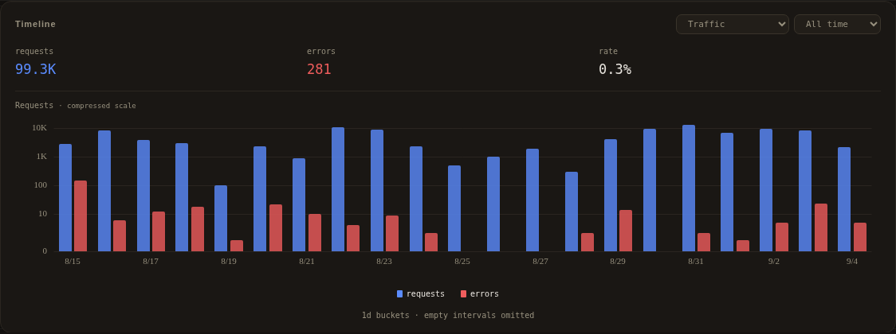

### Errors

**Errors** compares the count of affected requests with an error-rate line on
a separate percentage axis. A request that only encountered HTTP 429 is not
an error. A recovered failure can still contribute an error signal.

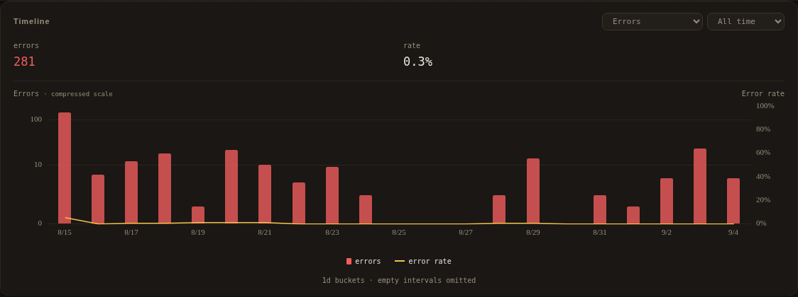

### Token usage

**Tokens** compares input, output, reasoning and cached usage. The upstream's
reported fields determine which splits are available. The compressed vertical
scale keeps large prompt/cache volumes and small outputs readable together.

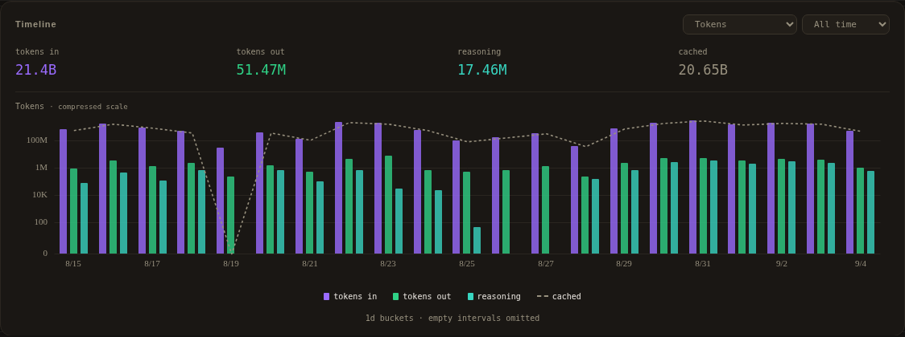

### Speed and latency

**Speed + latency** compares output throughput with time to first token on
separate axes. One percentile dropdown controls both series; the legend does
not repeat it. Missing measurements remain unavailable rather than invented.
Period readouts use the period's samples, not an average of bucket percentiles.

### Provider-reported cost

**Cost** shows reported spend alongside request counts. Values below $1 use
cents, including tooltips and totals. Missing provider cost does not establish
a zero bill, and there is no hardcoded per-model price table.

## Explorer

The dimensions are Providers, Models, Clients, Conversations, Tools, Time,
Status, Errors and Keys. A card adds an exact scope; the breadcrumb chips remove
individual selections or return to all traffic. Multi-valued dimensions, such
as tools and errors, can overlap rather than partition requests.

### Providers

Provider cards compare request share, reported cost, tokens, cache use, timing
and health. Error and HTTP 429 badges count distinct affected requests and omit
zero values independently. A request can contribute to both badges.

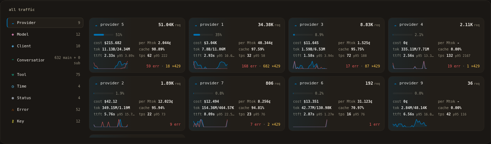

### Models

Model cards group configured model variants for comparison. Selecting one scopes
the timeline and request log together. Model grouping is configuration-owned;
raw request spellings remain available for exact export and deletion filters.

Conversation ancestry is explicit, not guessed from timing or names. The
authorized snapshot has no parent declarations, so these screenshots do not
fabricate an agent tree. See the [client protocol](protocol.md) for relationship
headers and the limits of missing, conflicting or ambiguous declarations.

## Request inspection

### Request table

The request table combines recent finalized records with current in-flight
state during ordinary live use. Rows show status, retry information, latency,
throughput, token/cache usage, tool calls, duration, queue time and reported cost.
Its status selector and older-history paging operate on the current scope.

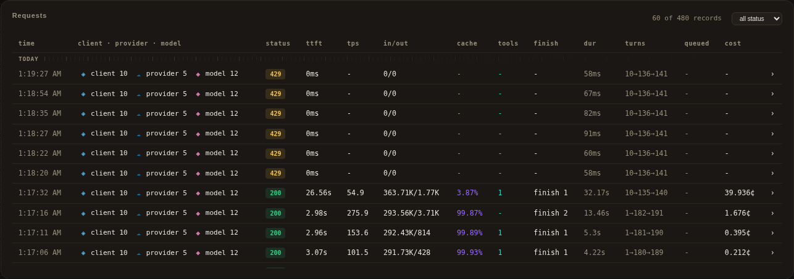

### Request details

Click a row or its detail button to open the drawer. Identity, upstream model,
captured parameter values and conversation shape stay attached to that request.
Previous/next controls follow the scoped table order. Explicit zero and false
parameter values are retained instead of treated as missing.

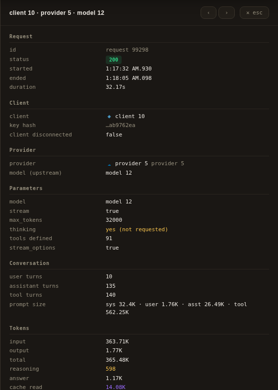

### Tokens and performance

Scroll the same drawer for token splits, timestamps, throughput, reported cost,
tool information and queue/rate-limit observations. Absorbed retry attempts
appear when the selected request has them. These captures deliberately omit
request content and Debug payloads; ordinary opt-in captures remain sensitive.

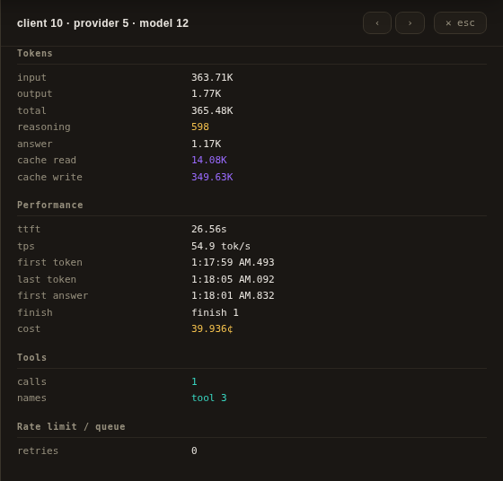

## Operator menus

The top-right buttons open these menus. Opening a menu does not execute its
actions. The pictures show an idle isolated instance with recorded history,
not active operator policies from the source instance.

### Pause

Pause queues newly admitted matching work by scope rather than canceling streams
already running. The menu exposes scopes, durations and current holds, including
resume/edit controls when applicable. Queue limits still apply.

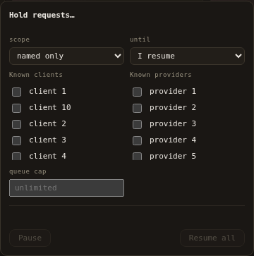

### Debug

Debug starts a scoped capture session with timed or manual stop. Retained
captures have separate size and lifetime limits. It is
opt-in and can retain sensitive request/response bodies even when known secret
headers are redacted. No debug session was enabled for this screenshot.

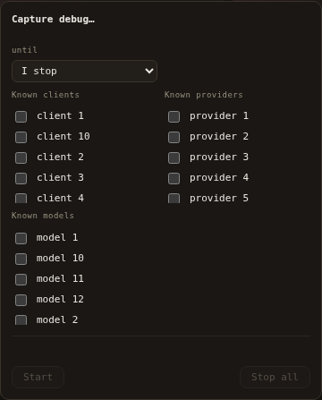

### Limits

Limits sets provider-wide request, token and concurrency budgets. These limits
are distinct from key-scoped scheduling and upstream rate-limit observations.
The menu shows the selected provider's configured controls and active policies.

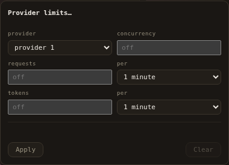

### Logs

Logs selects a full-history export using the shared provider, model, client,
status, error, debug and age filters. The menu's count preview is separate from
the recent rows currently loaded in the browser. No export was downloaded here.

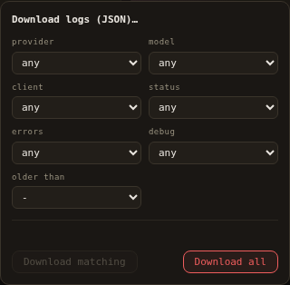

### Clear

Clear shares those filter controls for deletion. The action preview identifies
the accepted selection; deleting is not a way to reset a chart window.
The screenshot leaves every filter empty and executes no deletion.

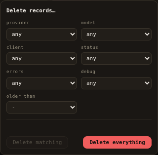

### Restart

Source deployments can rebuild and restart through a staged handoff. The menu
explains the operation; the action is disabled while a restart is underway.
Status updates refresh the dashboard automatically. Container images do not
contain the source/compiler and require an external container update/restart.
This screenshot only opens the menu and does not start a restart.

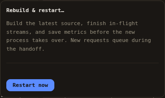

See [operations](operations.md) for exact admission, persistence, filtering,
restart and failure behavior before using these controls.

## Settings

Settings uses the same schema, validation and defaults as configuration files.
Search finds fields across categories. Changed values are revision-checked;
the UI identifies hot-reload and restart requirements. Structured fields replace
their whole map/list value rather than recursively merging nested entries.
The generated [configuration example](../proxy.example.yaml) documents every
field, including categories not pictured here.

### Dashboard cadence

Dashboard settings control log-window size and polling/aggregate refresh
cadence. Live rows and the in-flight gauge remain distinct from periodic chart
and explorer aggregation.

### Queue and retry

Queue and retry settings bound admission and retry behavior. Their help text
distinguishes queue waiting, provider retry hints, retry budgets and capacity.
Tune them for the upstream and workload; the picture uses the public example.

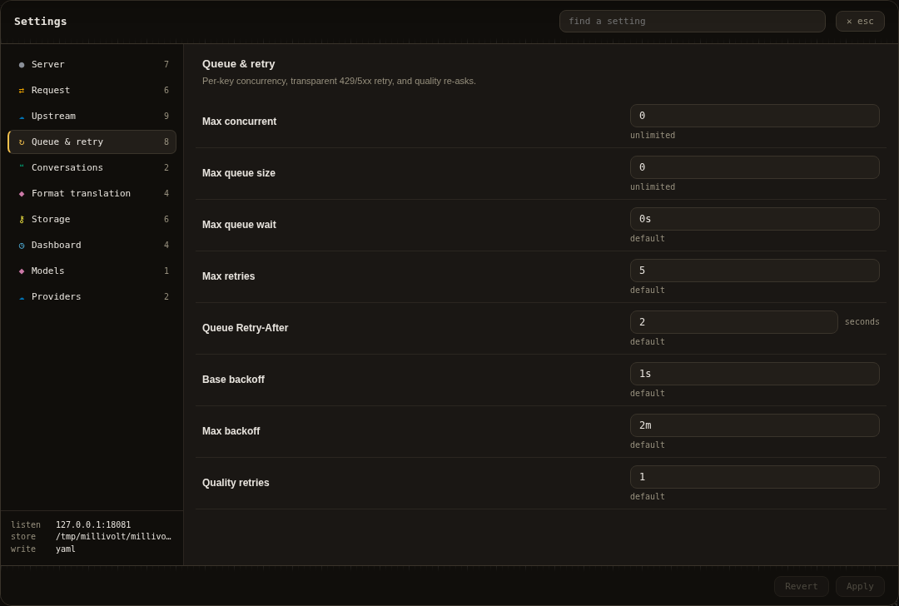

### Storage

Storage settings control the SQLite writer and its bounded queue/batches.
Metrics persistence is best-effort under sustained overload; a successful
inference response does not prove its record was stored. The dashboard reports
process-local storage drops.

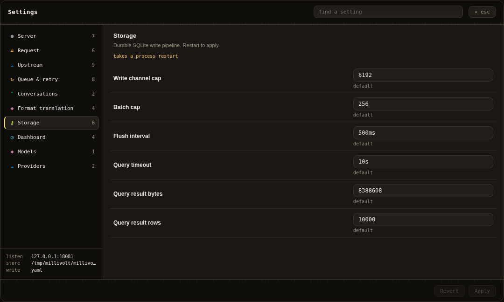

### Provider compatibility

The example enables Grok and Cursor compatibility profiles without credentials
or upstream registrations. Their headers and metadata mappings are editable
operator-selected snapshots, not guaranteed current provider contracts.
See [adapters](adapters.md#bundled-compatibility-profiles) before relying on them.

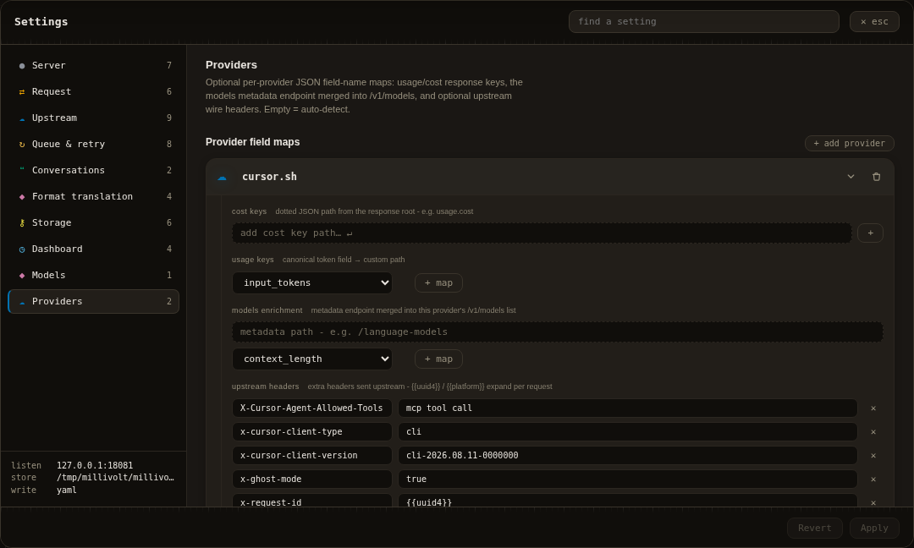

See [Contributing](../CONTRIBUTING.md#documentation-screenshots) before refreshing
the gallery. Never publish private configuration, bodies, credentials or raw
history copies.
