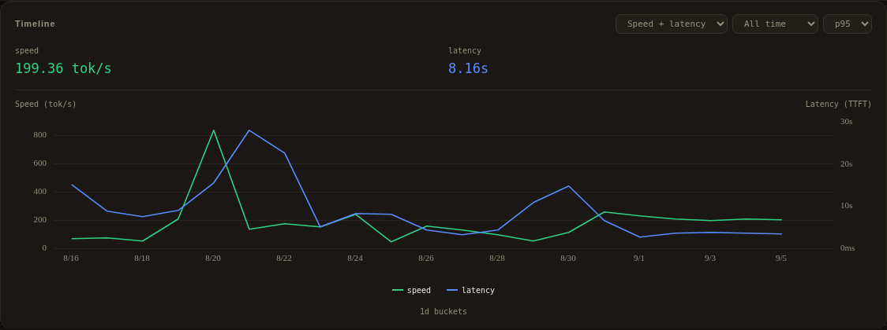
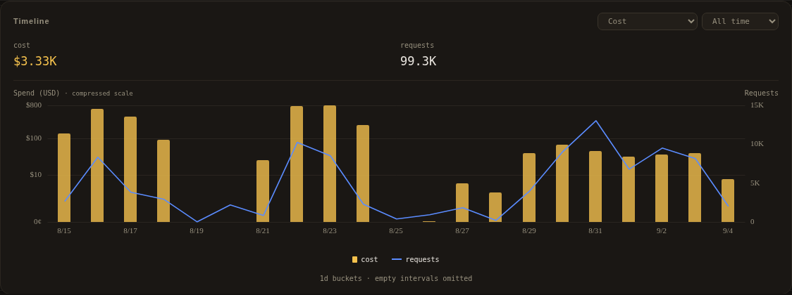
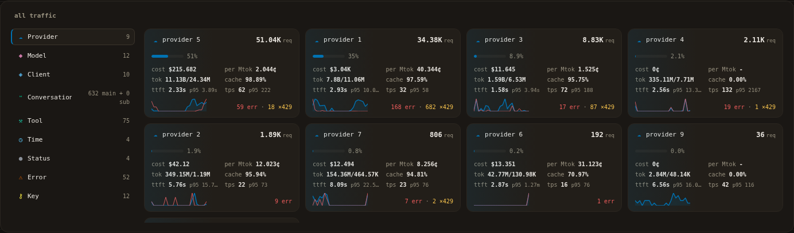
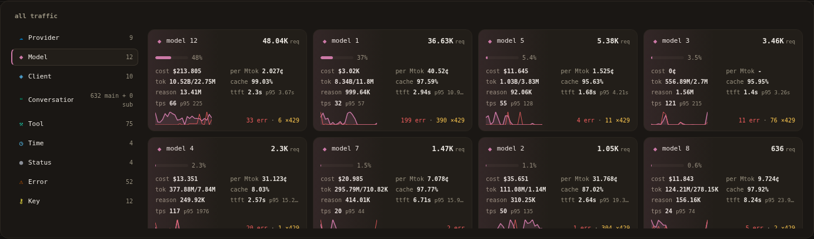
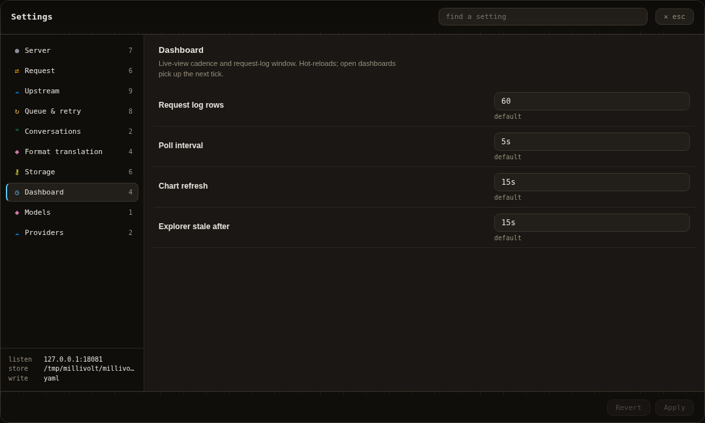

# Dashboard guide

The [overview](../README.md#dashboard-overview) shows the complete dashboard.
These focused views explain its main controls. History captures use an explicitly
authorized local snapshot with replaced identifiers, retaining recorded timing,
token and cost values. They are not latency guarantees, capacity measurements or
independent billing. Settings shows public defaults instead of private config.
The KPI band remains global; explorer filters scope the timeline and request log.
The capture session intentionally disables live SSE and uses a static snapshot,
so an **offline** footer in these images is expected, not a live-service status.

## Token usage

Choose **Tokens** in the timeline to compare input, output, reasoning and cached
usage. The provider's reported fields determine which splits are available.
Change the time range without changing the selected explorer scope.

## Speed and latency

**Speed + latency** compares output throughput with time to first token on
separate axes. One percentile dropdown controls both series; the legend does
not repeat it. Missing measurements remain unavailable rather than invented.

## Provider-reported cost

**Cost** shows reported spend alongside request counts. Values below $1 use
cents, including tooltips and totals. Missing provider cost does not establish
a zero bill, and there is no hardcoded per-model price table.

## Provider exploration

Choose Providers, Models or another dimension to group the same history. Select
a card to narrow the view. Error and HTTP 429 badges count distinct affected
requests; a 429 alone is not an error, and zero badges are omitted.

## Model exploration

Switch to Models to compare grouped request volume, usage, cost and health.
Selecting a model card scopes the timeline and request log together. Model
grouping rules are configuration-owned; stored request spellings remain intact.

## Settings

Settings uses the same schema, defaults and validation as configuration files.
Fields identify hot-reload and restart behavior; changes are revision-checked.
This capture shows public dashboard defaults, not an operator's private config.

See [operations](operations.md) for persistence and reload behavior, and
[Contributing](../CONTRIBUTING.md#documentation-screenshots) before regenerating
screenshots. Never publish private configuration, request bodies or credentials.
