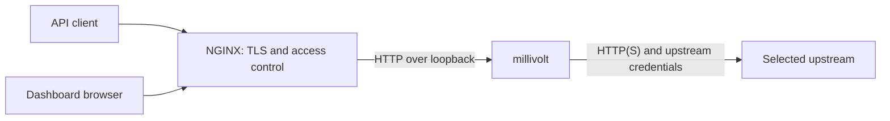

# Reverse proxy and remote access

Use a protected ingress when accessing millivolt beyond a trusted local machine.
The whole dashboard is gated by the shared `MILLIVOLT_OPERATOR_TOKEN`
credential; there is no tenant isolation and no per-user identity. Only the
unauthenticated `/healthz` probe, origin-root brand/PWA files (`/favicon.ico`,
icons, `/manifest.webmanifest`, `/sw.js`) and transparent inference
stay open, so a load balancer can health-check the service without holding
the credential.
See [operator access](operations.md#operator-access). Read
[Security](../SECURITY.md) first.

## NGINX setup

[deploy/nginx.conf](../deploy/nginx.conf) is the canonical example. It serves
millivolt at the origin root, with NGINX on the same host as the loopback-published
Compose service. Use a maintained NGINX release with the `http2 on` directive
(introduced in 1.25.1), not the deprecated `listen ... http2` syntax.

The sample splits two prefix locations because they do not share an access
model. `location /v1` is the OpenAI-compatible inference base: preserve provider
`Authorization` and routing headers, and allowlist API clients. `location /`
is the dashboard and operator plane (`/dash/`, `/metrics/`, `/admin/`,
`/healthz`, `/favicon.ico` and the other brand/PWA files): allowlist operators, and keep `Host` plus the
session cookie so Settings origin checks and the live feed work. Shared
streaming proxy settings live on the `server` so both SSE paths stay
unbuffered. Prefix `/v1` wins over `/` for `/v1/chat/completions` and
`/v1/models`; `GET /models` without that prefix follows `location /` unless
you add an exact `/models` block with the inference rules.

1. Start the normal [Compose deployment](../README.md#docker-compose), retaining
   its loopback-only host port.
2. Copy the example into your NGINX HTTP configuration. Replace its example
   hostname, certificate paths and the two TEST-NET allowlists. The supplied
   address is a placeholder; unmatched clients are denied. The lists may differ
   when operators and API clients are not the same sources.
   Set `proxy_pass` to the chosen host port if `MILLIVOLT_PORT` is not 8080.
3. Validate with `nginx -t` before reloading your existing NGINX service. Confirm
   a trusted client and a denied client on both `/` and `/v1`.
4. Use `https://your-hostname/` for the dashboard and
   `https://your-hostname/v1` as the client API base. Keep sending the actual
   upstream base/key as described in the [client setup](../README.md#connect-a-client).

The sample is a `server` block, included under NGINX's existing `http` context,
not a replacement for the entire installation configuration. It does not issue
certificates or configure your firewall. Do not expose the original proxy port
alongside the protected HTTPS endpoint.

### Streaming and request handling

The example disables response/request buffering and proxy retries so the edge
does not batch SSE events or independently replay inference. It leaves HTTP
statuses intact, disables edge compression/caching, and ignores special upstream
`X-Accel-*` controls for buffering, redirects, rate limits, caching and charset.
Millivolt uses SSE, not a WebSocket endpoint; no `Upgrade` block is needed.

It preserves the external `Host`, including a nondefault port, so browser-origin
checks on Settings and other mutations keep working. NGINX's body-size gate is
disabled in the sample: millivolt's existing `max_request_bytes` remains the
application limit, rather than an accidentally smaller duplicate at ingress.
Choose edge idle timeouts for your deployment. `proxy_read_timeout` limits the
gap between upstream reads, not the total lifetime of a stream.

These behaviors follow the official [proxy module](https://nginx.org/en/docs/http/ngx_http_proxy_module.html),
[HTTP core module](https://nginx.org/en/docs/http/ngx_http_core_module.html) and
[HTTP/2 module](https://nginx.org/en/docs/http/ngx_http_v2_module.html).

## Credentials and access control

The sample uses a trusted IP/VPN allowlist on each location, preserving
provider `Authorization` on `/v1` and the operator Bearer or session cookie on
`/`. Replace each placeholder with the addresses you intend to trust for that
plane. If another load balancer is in front of NGINX, do not trust arbitrary
forwarded client-address headers; configure that trusted proxy boundary
deliberately. TLS encrypts traffic but does not authorize callers.
See NGINX's [access module](https://nginx.org/en/docs/http/ngx_http_access_module.html)
and [TLS configuration](https://nginx.org/en/docs/http/ngx_http_ssl_module.html).

If you instead add HTTP Basic authentication on `/v1`, `Authorization` contains
the ingress credential and cannot simultaneously contain the provider bearer
key. Supply the provider key through `X-Proxy-Key`, and clear the consumed
ingress header before forwarding with `proxy_set_header Authorization "";`.
The same conflict applies on `/`: a browser behind Basic auth cannot also
present the dashboard's Bearer credential in the same header, so gated actions
fail. Prefer an address/VPN allowlist as in the sample, or an ingress that
adds its own credential through a different mechanism and forwards
`Authorization` untouched. Do not put Basic auth on `/v1` to "protect
inference" while leaving `/` on Bearer: that still overwrites the provider key.
The same separation applies to other ingress-only credentials: do not forward
them to an LLM provider. Clients must support your ingress authentication and
the proxy's custom routing headers.

## Container networking and other ingress servers

When NGINX itself is a container, `127.0.0.1` points back to NGINX, not millivolt.
Attach it to the same private Docker network and use `http://millivolt:8080` as
its upstream instead. Only the edge needs a publicly reachable port. Do not bind
millivolt to loopback inside its container, which would prevent peer access.
`MILLIVOLT_PORT` changes host publication, not this internal service port.

For another ingress implementation, preserve these same boundaries: protect the
origin, keep inference and the operator plane as separate access rules, forward
the original authority and required custom headers, allow streaming without
response buffering, avoid automatic inference retries, and choose upload/idle
limits deliberately. Subpath hosting is not the supplied deployment: dashboard
assets and routes expect the origin root.
